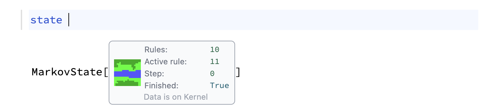
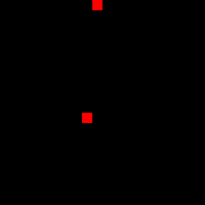
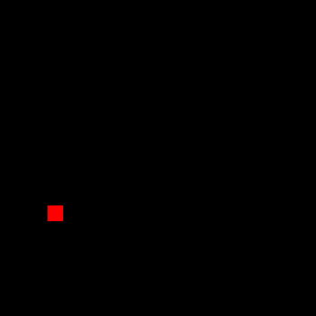
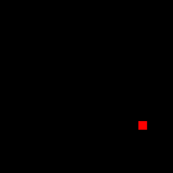
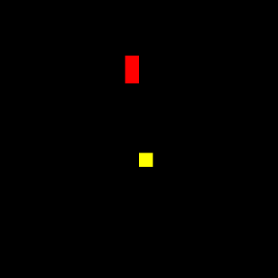
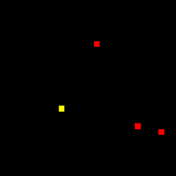

# MarkovJunior

A small MarkovJunior-style rewrite engine in vanilla (almost) Wolfram Language.

> Wolfram Language is generally built around pattern matching; therefore, MarkovJunior can be implemented naturally using native `ReplaceAll`, `Rule`, and `Pattern` symbols. Most of the code is used for building a friendly API and performing error checks.



## Attribution

This project is inspired by
[MarkovJunior](https://github.com/mxgmn/MarkovJunior), the probabilistic
programming language by Maxim Gumin. The language, core idea, and many example
patterns come from that original project.

This repository is only a small, partial Wolfram Language implementation of
some MarkovJunior-style array rewrite behavior. It is not a full port of the
original interpreter or language.

## Requirements

- Wolfram Language 13.0 or newer
- A 2D array as input

3D arrays are not supported yet.

## Current Scope

Implemented:

- 2D array rewrite states
- single random-match rule groups with `1`
- whole-array replacement groups with `All`
- automatic rotations and mirrored rotations for rules

Not implemented:

- the original XML importer
- observations, constraints, fields, search, and inference
- 3D grids and voxel output

## Installing / Loading

From this repository directory:

```wolfram
PacletDirectoryLoad[Directory[]];
Needs["CoffeeLiqueur`Workshop`MarkovJunior`" -> "mj`"];
```

Or run directly any suitable example from `Examples/` folder

## Symbols

```wolfram
mj`MarkovState[array, rules]
mj`Propagate[state]
mj`GetArray[state]
mj`FinishedQ[state]
```

Rules are grouped as:

```wolfram
{
  1 | All,             (* apply one random match, or all matches *)
  _Integer | Infinity, (* maximum number of propagation steps for this group *)
                       (* symmetry operations to be applied *)
  Automatic | All | None | "Rotation" | "Mirror" | "MirrorX" | "MirrorY",    
  {rules...}
}
```

A `1` group chooses one transformed result at random from the available matches.
An `All` group applies replacements across the whole array. 

Rules are tried with rotations and mirrored rotations, so simple 0D or 1D directional rules can apply in every orientation.

If symmetry operations is set to `Automatic`, only 1D and 0D rules will be symmetrized, the rest will be applied as it is.

## Basic Rules Examples

Single-cell replacement:



```wolfram
state = mj`MarkovState[Table[Black, {20}, {20}], {
  {1, Infinity, Automatic, {Black -> Red}}
}];
```

Growth model:



```wolfram
state = mj`MarkovState[Table[Black, {20}, {20}], {
  {1, 1, Automatic, {
    Black -> Red
  }},
  {1, Infinity, All, {
    {a___, Black, Red, b___} :> {a, Red, Red, b}
  }}
}];
```

Self-avoiding walk:



```wolfram
state = mj`MarkovState[Table[Black, {20}, {20}], {
  {1, 1, Automatic, {
    Black -> Red
  }},
  {1, Infinity, All, {
    {a___, Red,Black,Black, b___} :> {a, White,Gray,Red, b}
  }} 
}];
```

Then to run this example call `Propagate` method:

```wolfram
state = mj`Propagate[state];
state // mj`GetArray // ArrayPlot
```

To export it as GIF animation, one can use `Image` as a wrapper:

```wolfram
imgs = Table[ImageResize[
  Image[(state=mj`Propagate[state])//mj`GetArray], {350,350}, Method->"NearestNeighbor"], {100}];
Export["ex.gif", AnimatedImage[imgs, FrameRate->25]]
```


## River Generator Example

The bundled notebook in [`Examples/Example.*`]
builds a small procedural river scene



The same rules can be written as plain
Wolfram Language by naming the colors first:

```wolfram
empty = GrayLevel[0];
yellow = RGBColor[1, 1, 0];
red = RGBColor[1, 0, 0];
river = RGBColor[1/3, 1/3, 1];
grass = RGBColor[0, 1, 0];
darkGrass = RGBColor[0, 2/3, 0];

riverRules = {
  (* Create two random seed points. *)
  {1, 1, Automatic, {empty -> yellow}},
  {1, 1, Automatic, {empty -> red}},

  (* Flood both seed regions randomly. *)
  {
    1,
    Infinity,
    Automatic,
    {
      {a___, red, empty, b___} :> {a, red, red, b},
      {a___, yellow, empty, b___} :> {a, yellow, yellow, b}
    }
  },

  (* Mark the meeting edge as river. *)
  {
    All,
    Infinity,
    Automatic,
    {
      {a___, red, yellow, b___} :> {a, river, river, b}
    }
  },

  (* Remove the temporary flood colors. *)
  {
    All,
    Infinity,
    Automatic,
    {
      {a___, yellow, b___} :> {a, empty, b},
      {a___, red, b___} :> {a, empty, b}
    }
  },

  (* Expand the river once  *)
  {
    All,
    1,
    Automatic,
    {
      {a___, river, empty, b___} :> {a, river, river, b}
    }
  },

  (* Place grass around the river, then fill the rest. *)
  {
    All,
    Infinity,
    Automatic,
    {
      {a___, river, empty, b___} :> {a, grass, grass, b}
    }
  },
  {
    1,
    13,
    Automatic,
    {
      {a___, empty, b___} :> {a, darkGrass, b}
    }
  },
  {
    1,
    Infinity,
    Automatic,
    {
      {a___, darkGrass, empty, b___} :> {a, darkGrass, darkGrass, b},
      {a___, grass, empty, b___} :> {a, grass, grass, b}
    }
  }
};

initialState[size_: 20] := mj`MarkovState[
  ConstantArray[empty, {size, size}],
  riverRules
];
```

## Flowers




## Platforms


## WLJS Notebook

> See `Examples/Example.wln`

For [WLJS Notebook](https://wljs.io) in
`Examples/`, load the package from the parent directory:

```wolfram
PacletDirectoryLoad[NotebookDirectory[] // ParentDirectory];
Needs["CoffeeLiqueur`Workshop`MarkovJunior`" -> "mj`"];
```

After evaluating the river-generator definitions above:

```wolfram
state = initialState[20];

Refresh[
  state = mj`Propagate[state];
  ArrayPlot[mj`GetArray[state]],
  1/30.0
]
```

The two-argument `Refresh[expr, seconds]` form is specific to WLJS. In
Mathematica notebooks, use the `Dynamic[Refresh[..., UpdateInterval -> ...]]`
form shown above.


### Wolframscript

> See `Examples/Example.wls`

The repository includes a standalone script version at
[`Examples/Example.wls`](Examples/Example.wls). Clone repository and run:

```sh
wolframscript -file Examples/Example.wls
```

The script exports the rendered result to `Examples/markov-river.png`.


### Mathematica Notebook

> See `Examples/Example.nb`

In a Mathematica notebook, use the standard Wolfram Language `Refresh` option
syntax inside `Dynamic`. If the notebook is in this repository root:

```wolfram
PacletDirectoryLoad[NotebookDirectory[]];
Needs["CoffeeLiqueur`Workshop`MarkovJunior`" -> "mj`"];
```

Then evaluate the river-generator definitions above, followed by:

```wolfram
DynamicModule[{state = initialState[40]},
  Dynamic[
    Refresh[
      If[! mj`FinishedQ[state], state = mj`Propagate[state]];
      ArrayPlot[mj`GetArray[state], PixelConstrained -> 10],
      UpdateInterval -> 1/30,
      TrackedSymbols :> {}
    ]
  ]
]
```

`TrackedSymbols :> {}` is useful here because the display should refresh on a
timer, not only when a notebook symbol changes.

